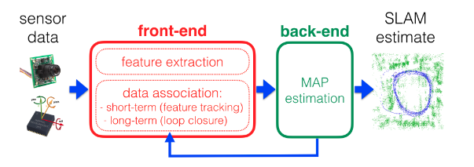

# Past, Present, and Future of SimultaneousLocalization And Mapping: Towards theRobust-Perception Age

## 2. ANATOMY OF AMODERNSLAM SYSTEM

### front-end

Abstracts sensor data into models that are amenable forestimation

### back-end

Perform inference on the abstrscted data produced by front-end  

