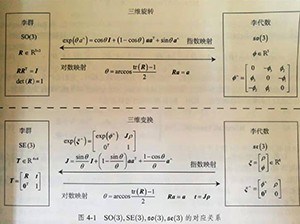

# SLAM第四讲李群李代数部分

## 指数与对数映射

### $SO(3)$上的指数映射

已知,$SO(3)$引入过程中存在式
$$
\dot{R} (t) = \hat{\phi(t)} R(t)
$$
解此微分方程得到
$$
R(t) = exp(\hat{\phi(t)})
$$
对于上述矩阵的指数映射,可以通过泰勒展开进行分析  
但只有在收敛情况下才有结果,其结果仍为一个矩阵:
$$
exp(\hat{\phi}) = \sum_{n=0}^\infty \frac{1}{n!} (\hat{\phi})^n
$$
泰勒展开难以计算,但是考虑到 $\phi$ 为反对称矩阵,  
令 $\phi = \theta a$ 其中, $\theta$ 为模长 $\hat{a}$为方向  
又由反对称矩阵性质得到
$$
\begin{aligned}
\hat{a}\hat{a} = aa^T - I\\
\hat{a}\hat{a}\hat{a} = - \hat{a}
\end{aligned}
$$
通过上述两式对泰勒展开进行化简,得到
$$
\begin{aligned}
exp(\hat{\phi}) & = sum_{n=0}^\infty \frac{1}{n!} (\hat{\phi})^n\\ 
& = aa^T +(\theta - \frac{1}{3!} \theta^3 + \frac{1}{5!} \theta^5 - ...)\hat{a} - (1 - \frac{1}{2!} \theta^2 + \frac{1}{4!} -...)\hat{a}\hat{a}\\
& = \cos \theta I + (1 - \cos \theta)aa^T + \sin \hat{a}
\end{aligned}
$$
最终化简的结果与罗德里格斯公式如出一辙这表明 $so(3)$ 实际上就是由所谓的轩转向量组成的空间而指数映射即罗德里格斯公式.  
通过罗德里格斯里格斯公式,可以将$so(3)$中任意向量,对应于$SO(3)$中的旋转矩阵.  
反之,通过对数映射,可以将$SO(3)$中的元素对应到$so(3)$中,但没必要进行泰勒展开求解,利用矩阵的迹的性质分别求解转角和转轴更为方便.

要注意的是:指数映射是满射,而非单射,但当将旋转角固定在 $\pm \pi$ 之间,李群和李代数元素是一一对应的

### $SE(3)$上的指数映射

形式如下:
$$
\begin{aligned}
exp(\hat{\xi}) &= 
\left[
  \begin{matrix}
    \sum_{n=0}^\infty (\hat{\phi}^n) & \sum_{n=0}^\infty \frac{1}{(n+1)!} (\hat{\phi})^n \rho \\
    0^T & 1
  \end{matrix}
\right] \\
&=
\left[
  \begin{matrix}
    R & J \rho \\
    0^T & 1
  \end{matrix}
\right] = T
\end{aligned}
$$
令 $\phi = \theta a$ 利用泰勒展开推导
$$
\begin{aligned}
\sum_{n=0}^\infty \frac{1}{(n+1)!} (\hat{\phi})^n = & I + \frac{1}{2!} \theta \hat{a} + \frac{1}{3!} \theta \hat{a}^2 + \frac{1}{4!} \theta \hat{a}^3 + \frac{1}{5!} \theta \hat{a}^4 + ...\\
&=I + \frac{1}{\theta} (\frac{1}{2!} \theta^2 - \frac{1}{4!} \theta^4 +...)\hat{a} + \frac{1}{\theta} (\frac{1}{3!} \theta^3 - \frac{1}{5!} \theta^5 + ...)\hat{a}^2 \\
&= \frac{\sin\theta}{\theta}I + (1-\frac{\sin\theta}{\theta})aa^T + \frac{1-\cos\theta}{\theta}\hat{a} =^{def} J
\end{aligned}
$$
从结果中观察, $\xi$ 中坐上角 $R$ 是 $SO(3)$ 中的元素,与 $se(3)$ 中轩转部分 $\phi$ 对映. 而右上角的 J 由上面的推导给出.  
$J$ 与罗德里格斯公式有些相似,但不完全一样.可以看到平移部分经过指数映射后,发生了一次以 $J$ 为系数矩阵的线性变换.  
具体转换关系参见图片  

## 李代数求导与扰动模型

### BCH公式与近似形式

如何能够表达,SO(3)中两个矩阵完成乘法时,李代数层次上的变化呢?  
经过推证,并不存在:  
$$
\ln(\exp(A)\exp(B)) = A+B
$$
两个李代数指数映射乘积的完整形式,由Baker-Campbell Hausdorff 公式(BCH公式)给出.  
其完整形式过于复杂,在此给出近似表达
$$
\check{\ln(\exp(\hat{\phi_1})\exp(\hat{\phi_2}))} \approx
  \left\{
    \begin{aligned}
    J_l (\phi_2)^{-1}\phi_1 +\phi_2 ,\:当\phi_1 为小量\\
    J_r (\phi_1)^{-1}\phi_2 +\phi_1 ,\:当\phi_2 为小量
    \end{aligned}
  \right.
$$
两个近似分别描述了左乘或右乘微小位移的情况,在涉及到求导时,一定注意左乘和右乘的区别  
以下内容以左乘为例  
左乘BCH近似雅各比矩阵为 SE(3)指数映射得到的 $J$ 即
$$
J_l = J = \frac{\sin\theta}{\theta}I + (1-\frac{\sin\theta}{\theta})aa^T + \frac{1-\cos\theta}{\theta}\hat{a}
$$
其逆为
$$
J_l^{-1} = \frac{\theta}{2} \cot \frac{\theta}{2} I + (1 - \frac{\theta}{2} \cot \frac{\theta}{2})aa^T - \frac{\theta}{2} \hat{a}
$$
而右乘近似雅各比为对自变量取符号即可
$$
J_r (\phi) = J_l (-\phi).
$$
以上,我们可以建立李群与李代数之间关系:
对于某个旋转 $R$ , 对应李代数 $\phi$ , 左乘一个微小旋转,记作 $\Delta R$, 对应李代数为 $\Delta \phi$  
那么在李群上 $R \Delta R$,在李代数上可以根据BCH近似得到 $J_l^{-1}(\phi)\Delta\phi +\phi$ 即
$$
\exp(\Delta \hat{\phi}) \exp (\hat{\phi}) = exp(\hat{(\phi + J_l^{-1} (\phi) \Delta \phi)})
$$
反之,在李代数上进行加法,可以近似为李群带上左右雅各比的乘法:
$$
\exp(\hat{(\phi + \Delta \phi)}) = \exp(\hat{(J_l \Delta\phi)})\exp(\hat{\phi}) = \exp(\hat{\phi})\exp(\hat{(J_r \Delta \phi)})
\tag{4.35}
$$
这就为李代数上的微积分提供了理论基础.同样的,对于SE(3),也有BCH近似,在此略去

### SO(3)上的李代数求导

设某一时刻机器人位姿为 $T$ ,它观察到了一个世界坐标位于 $p$ 的点,产生了观测数据 $z$ 由坐标变换关系知:
$$
z = Tp + \omega
$$
其中 $\omega = z - Tp$ 为随机噪声.
假设共有 $N$ 个这样的路标点和观测,于是就有N个上式.那么对机器人进行位姿估计,即寻找最优的T,使得整体误差最小,即
$$
\min_T J(T) = \sum_{i=1}^N \mid \mid z_i - Tp_i \mid \mid_2^2
$$
在SLAM中会经常构建与位姿有关的函数,然后讨论该函数关于位姿的导数,以调整当前的估计值.  
$SO(3),SE(3)$仅对乘法封闭,不对加法封闭,因而转换到李代数角度进行分析,主要有两种思路

1. 李代数表示姿态,然后根据李代数加法对李代数求导
2. 对李群左乘或右乘微小扰动,然后对该扰动求导,称为左扰动或右扰动模型
  
第一种对应到李代数的求导模型,第二种对应到扰动模型

#### 李代数求导

首先考虑 $SO(3)$ 上的情况.假设我们对于空间点 $p$ 进行了旋转,得到了 $Rp$. 现在,要计算旋转之后点的坐标相对于旋转的导数,表示如下
$$
\frac{\partial R p}{\partial R}
$$
注意,此处不可按照矩阵微分定义导数,上述标记只是一个便于表达的记号  
由于 $SO(3)$ 并不对加法封闭, 所以该导数无法按照导数定义计算. 设 $R$ 对应的李代数为 $\phi$ 我们转而计算:
$$
\frac{\partial(\exp(\hat{\phi}))p}{\partial \phi}
$$
注意,矩阵微分中只能求解行向量相对于列向量的导数,所得结果仍然为矩阵,此处写成列向量对列向量的导数,可以认为先对分子进行转置,再对结果进行转置   
按照导数定义
$$
\begin{aligned}
  \frac{\partial(\exp(\hat{\phi}))p}{\partial \phi} = & \lim_{\delta \phi \rightarrow 0} \frac{\exp(\hat{(\phi + \delta \phi)})p - \exp(\hat{\phi})p}{\delta \phi} \\
  = & \lim_{\delta \phi \rightarrow 0} \frac{\exp(\hat{J_l \delta \phi})\exp(\hat{\phi})p - \exp(\hat{\phi})p}{\delta \phi}\:\: (结合式 4.35) \\
  = & \lim_{\delta \phi \rightarrow 0} \frac{I+\hat{(J_l \delta \phi)}exp(\hat{\phi})p - \exp(\hat{\phi})p}{\delta \phi}\:\: (对上式分子第一项做一阶泰勒展开)\\
  = & \lim_{\delta \phi \rightarrow 0} \frac{\hat{(J_l \delta \phi)} exp (\hat{\phi})p}{\delta \phi}\:\: (整理上式)\\
  = & \lim_{\delta \phi \rightarrow 0} \frac{-\hat{(\exp(\hat{\phi})p)} J_l \delta \phi}{\delta \phi}\:\: (根据\:\hat{ }\:性质,类似向量外积) = -\hat{(Rp)} J_l
\end{aligned}
$$
由此得出旋转后的点相对于李代数的导数:
$$
\frac{\partial R p}{\partial \phi} = -\hat{(Rp)} J_l
$$
上式含有较为复杂的左乘近似雅各比矩阵$J_l$,实际中,我们不希望计算它.  
下述扰动模型提供了更为简单的导数计算方式

#### 扰动模型(左乘)

另一种求导方式是对R进行一次扰动,看结果相对于扰动的变化率  
设左扰动 $\Delta$ 对应李代数为 $\Phi$ 然后对 $\Phi$ 求导, 即:
$$
\begin{aligned}
  \frac{\partial R p}{\partial \Phi} &= \lim_{\Phi \rightarrow 0} \frac{\exp(\hat{\Phi})\exp(\hat{\phi})p - \exp(\hat{\phi})p}{\Phi} \\
  &= \lim_{\Phi \rightarrow 0} \frac{(I+\hat{\Phi})\exp(\hat{\phi})p - \exp(\hat{\phi})p}{\Phi} (\:\: (对上式分子第一项做一阶泰勒展开)) \\
  &= \lim_{\Phi \rightarrow 0} \frac{\hat{\Phi} R p}{\Phi} \:\: (整理上式)\\
  &= \lim_{\Phi \rightarrow 0} \frac{-(\hat{Rp}) \Phi}{\Phi}\:\: (根据\:\hat{ }\:性质,类似向量外积) \\
  &=-\hat{(Rp)}
\end{aligned}
$$
相比于对李代数直接求导,结果中省去了一个雅各比 $J_l$ 的计算,这使得 扰动模型更为实用

#### SE(3)上的李代数求导(左乘扰动模型)

假设空间某点 $p$ 经过一次变换 $T$ (对应李代数为 $\xi$), 得到 $Tp$,现给 $T$ 左乘一个扰动 $\Delta T = \exp(\delta \hat{\xi})$ 假设扰动项李代数为 $\delta \xi = [\delta \rho \:,\: \delta \phi]^T$ 那么:
$$
\begin{aligned}
  \frac{\partial Tp}{\partial \delta \xi} &= \lim_{\delta \xi \rightarrow 0} \frac{\exp(\delta \hat{\xi}) \exp(\hat{\xi})p}{\delta \xi} \\
  &= \lim_{\delta \xi \rightarrow 0} \frac{(I + \delta \hat{\xi})\exp(\hat{\xi})p - \exp(\hat{\xi})p}{\delta \xi}\:\: (对上式分子第一项做一阶泰勒展开) \\
  &= \lim_{\delta \xi \rightarrow 0} \frac{\delta\hat{\xi}\exp(\hat{\xi})p}{\delta\xi}\:\: (对上式进行整理)\\
  &= \lim_{\delta \xi \rightarrow 0} \frac{
    \left[
    \begin{matrix}
      \delta \hat{\phi} & \xi \rho\\
      0^T & 0
    \end{matrix}
    \right]
    \left[
    \begin{matrix}
      Rp + t \\
      1
    \end{matrix}
    \right]
  }{\delta \xi}\:\: (将上式\hat{\xi},p 展开得到本式) \\
&= \lim_{\delta \xi \rightarrow 0} \frac{
\left[
\begin{matrix}
  \delta \hat{\phi} (R p + t) + \delta \rho \\
  0^T
\end{matrix}
\right]
}{[\delta \rho \:,\:\delta \phi]^T}\:\: (计算上式矩阵乘法) \\
&=
\left[
\begin{matrix}
I & -\hat{(Rp + t)} \\
0^T & 0^T
\end{matrix}
\right]\:\:(将上式进行整理) \\ 
&= (Tp)^{\bigodot}
\end{aligned}
$$

## 相似变换群与李代数