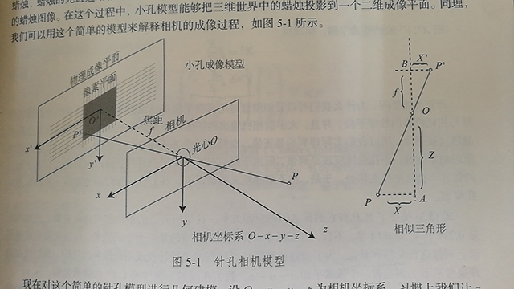

# SLAM14讲，第五讲

## 相机模型

三维世界中坐标点(单位为米) 映射到二位图像平面(单位为像素)，过程能够用一个几何模型进行描述。  
有很多种模型可以描述这个过程，最简单的为针孔模型  
在实际转换过程中，由于相机镜头上的透镜存在，使得光线投影到成像平面过程中会产生畸变。  
针孔模型 + 畸变模型，为最简单的相机模型，同时构成相机的内参数(Intrinsics)

### 针孔模型

  
像素坐标系通常定义方式为:以图像左上角为原点，$\upsilon$轴向右,$\nu$轴向下  
像素坐标系与成像平面相差一个缩放与一个原点的平移  
通过推导,空间中点 $P = (X, Y, Z)$ 在像素坐标系中坐标为
$$
\begin{aligned}
    \upsilon = f_x \frac{X}{Z} + c_x\\
    \nu = f_y \frac{Y}{Z} + c_y
\end{aligned}
$$
表达为矩阵形式
$$
\begin{aligned}
    Z\left(
        \begin{matrix}
            \upsilon \\ \nu \\ 1
        \end{matrix}
    \right) = \left(
        \begin{matrix}
            f_x & 0 & c_x \\ 
            0 & f_y & c_y\\
            0 & 0 & 1
        \end{matrix}
    \right) \left(
        \begin{matrix}
            X \\ Y \\ Z
        \end{matrix}
    \right) =^{def}= K P
\end{aligned}
$$
中间量组成的矩阵称为相机的内参数(Camera Intrinsics)矩阵 $K$

上述表达式中的 $P$ 是空间中点相机坐标系下的坐标  
但实际上,由于相机在运动,我们应当用世界坐标($P_w$)通过相机位姿变换得到的坐标进行表示,从而有:
$$\begin{aligned}
    ZP_{\upsilon \nu} = 
    Z\left[
        \begin{matrix}
            \upsilon \\ \nu \\ 1
        \end{matrix}
    \right] = K (R P_w + t) = KTP_w \:(此处隐含了非齐次到齐次坐标转换)
\end{aligned}
$$
其中,相机的 $R$ $t$ 又称为相机的外参数.相比于不变的内参,外参会随着相机运动发生改变  
<font color = #FF6197 size = 4>这也是SLAM中待估计的目标,代表机器人的轨迹 </font>  

投影过程还可以从另一个角度来看,即世界坐标转换为相机坐标系,在除掉它的最后一维数值,这相当于把最后一维进行归一化处理,在得到点 $P$ 在相机归一化平面上的投影
$$
(RP_w + t) = [X,Y,Z]^T(相机坐标) \rightarrow [X/Z,Y/Z,1]^T(归一化坐标) \:(这个式子丢失了深度信息)
$$
归一化坐标可看成相机前方 $z = 1$ 处平面上的一个点,这个平面也称为归一化平面  
<font color = #FF6197 size = 4>归一化坐标再左乘相机内参就得到了像素坐标</font>

### 畸变模型

畸变来自两个方面,一是透镜自身形状对光线传播造成影响,由此产生径向畸变,主要分为两类:桶形畸变与枕形畸变  
桶形畸变图像放大率随着与光轴之间距离增加而减小,枕形畸变恰好相反.

畸变另一方面来自于相机组装过程中,不能使透镜和成像平面严格平行,所以引入切向畸变
按照点的极坐标表示$(r,\theta)$进行理解,径向畸变可以理解为 $r$ 的变化, 切向畸变理解为坐标点沿切线方向的变化

对于相机坐标系中一点 $P$ 可以用5个畸变系数进行修正
$$
x_distorted = x(1 + k_1 r^2 + k_2 r^4 + k_3 r^6) + 2p_1 xy + p_2 (r^2 + 2x^2 )
y_distorted = y(1 + k_1 r^2 + k_2 r^4 + k_3 r^6) + p_1 (r^2 + 2y^2 ) + 2p_2 xy
$$
其中 $p_1,p_2$ 用于修正切向畸变  
将修复后的点通过内参数矩阵投影到像素平面得到该点再图像上的正确位置  
实际应用中,可以灵活选择矫正模型(调整畸变项的数量)

### 双目相机模型

### RGB-D 相机模型

## 图像

一张宽640 , 高480的图片 在计算机中可用一个二维数组表示

```二维数组表达图像
unsigned char image [480][640]
```

此处应当尤其注意 横纵坐标与二维数组对应关系  
一个灰度可以由8位整数记录,而RGB-D相机深度图中,一个像素的信息远超过0~255,因此可用一个16位整数记录,值位于0-65535,换算成米的话,可以最大表示65米,足够用.  
彩色图像表达需要通道概念,OpenCV彩色图中,默认通道顺序: B G R 需要透明度信息的话,可以用 R G B A 四个通道表示
