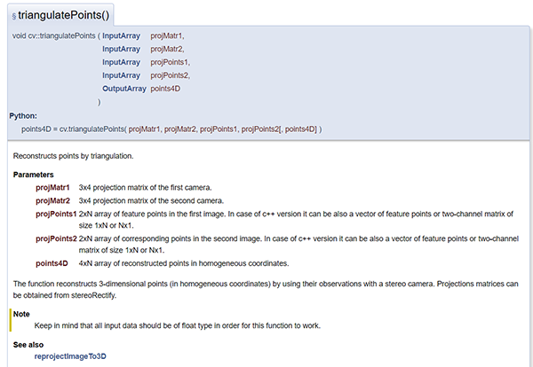

# SLAM14讲视觉里程计1笔记整理

## 特征点法介绍

经典SLAM模型中，称图像中具有代表性的，在相机视角发生少量变化后会保持不变的点为路标，视觉SLAM称之为特征(Feature).

- 特征是图像信息的林一种数字表达形式
- 特征点应当在相机运动前后保持稳定

图像区块特征识别难度大于边缘，大于角点
常见角点提取算法包括:

1. Harris角点
2. FAST角点
3. GFTT角点

当角点距离相机远近不同，以及相机旋转会导致传统角点匹配困难
为此，常年研究中，产生了更加稳定的局部图像特征，如

1. SIFT：准确，但计算量极大，需要GPU加速！
2. SURF：介于上下两者之间
3. ORB：由FAST改进而来，具有旋转与尺度不变性。快速，适用于实时SLAM

他们具有

1. 可重复性：相同特征能在不同图像中找到
2. 可区别性：不同特征有不同的表达
3. 高效率：同一图像中，特征点的数量应远小于像素的数量
4. 本地性：特征仅与一小片图像区域相关

特征点由关键点与描述子两部分组成
描述子通常是一个向量，描述了关键点周围像素的信息，只要两个描述子在向量空间的距离上相近就认为他们是同样的特征点

## ORB特征介绍

ORB特征由关键点(Oriented FAST)与描述子(BRIEF)两部分组成

1. 找出图像中的"角点"，相较于原版的FAST，ORB中计算了特征点的主方向
2. 对前一步提取出的特征点的周围图像区域进行描述(ORB也对BRIEF进行了一些改进)

### FAST关键点

FAST是一种角点，主要检测局部像素灰度变化明显的地方，思想是： 如果一个像素与领域的像素差别较大(过亮或过暗)，那么它更可能是角点提取详细步骤在此略过(课本157页)

ORB添加了尺度和旋转的描述

- 尺度不变性由构建金字塔，并在金字塔每一层上检测角点来实现
- 特征的旋转是由灰度质心法实现的

#### 灰度质心

质心是图像块灰度值作为权重的中心
$$
m_pq = \sum_{x,y \in B} x^p y^q I(x,y), p,q = \{0,1\}
$$ 
于是得到图像块儿的质心
$$
C = (\frac{m_{10}}{m_{00}},\frac{m_{01}}{m_{00}})
$$
连接图像块的几何中心O与质心C，得到一个方向向量 $\overrightarrow{OC}$ 于是特征点方向可以定义为
$$
\theta = \arctan (m_{01}/m_{10})
$$

#### BRIEF 描述子

BRIEF是一种二进制描述子，其描述向量由许多个0和1组成，这里的0和1编码了关键点附近两个随机像素的大小关系，取128哥这样的随机像素，得到最后由128维由0 1组成的向量
ORB在FAST特长点提取阶段计算了关键点的方向，所以可以利用方向性息，计算旋转之后的"Steer BRIEF"特征，使其具有较好的旋转不变性

## 特征匹配

特征匹配解决了SLAM中的数据关联问题  
匹配过程即对 $t$ 时刻图像上特征点 $x_t^m,\:m = 1,2,...,M$ 与所有 $x_{t+1}^m$ 测量描述子之间的距离,排序选最近(描述子表示两个特征之间相似程度)  
实际过程中,对于浮点类型描述子,我们通过欧氏距离进行度量,而二进制描述子,往往采用汉明距离(两二进制之间汉明距离指的是不同位数的个数).  
特征点数量大时,暴力匹配算法运算量较大,此时往往采取快速近似最临近(FLANN)算法

特征点法捕捉图像特征的局部特性，误匹配情况广泛存在，需要想办法解决! 高博采用了经验方法,汉明距离小于最小距离的两倍,且大于30,可以深入研究一下!

## 相机运动计算

相机为单目:对极几何
相机为双目,RGB-D时:通常采用ICP解决
一组为3D,一组为2D(得到了一些3D点和他们在相机的投影位置):PnP求解

### 对极几何(用于确定不同帧间相机位置的变化)

#### 对极约束

设第一帧 $I_1$ 到第二帧 $I_2$ 运动为 $R,t$,两个相机中心为 $O_1,O_2$  
考虑 $I_1$ 中特征点 $p_1$ 在 $I_2$ 中对应 $p_2$  
两者为空间中同一点,在两个成像平面的投影
有关几何关系,参见以下链接  

[有关对极几何的解释](https://www.cnblogs.com/wangguchangqing/p/8151128.html)  

从代数角度来分析几何关系，第一帧坐标系下，设 $P$ 的空间位置为
$$
P = [X,Y,Z]^T
$$
根据针孔相机模型,我们得到两个像素点 $p_1, p_2$ 的位置
$$
\begin{aligned}
    &s_1 p_1 = K P\\
    &s_2 p_2 = K(RP + t)
\end{aligned}
$$
这里 $K$ 为相机内参矩阵, $R,T$ 为相机运动(实际计算为 $R_{21},\: t_{21}$),上式也可表达为李代数形式

此处引入尺度意义下相等(equal up to a scale):
使用齐次坐标时,一个向量将等于它自身乘上任意的非零常数,这通常用于表达一个投影关系,例如: $s_1 p_1$ 和 $p_1$ 成投影关系,它们在齐次坐标意义下相等,记作:
$$
sp \simeq p
$$
详细来说,假设存在二维向量,及其齐次形式如下
$$
\begin{aligned}
    &[x,y,z] \\
    &[x,y,z,1]
\end{aligned}
$$
对于任意 $k[x,y,z]$ 我们无法同时得知 $k$ 与 [x,y,z]  
而对于任意 $k[x,y,z,1]$ 我们可以通过最后一维得知 $k$ 进而推导出原始的 $[x,y,z]$  
对于函数而言,齐次性定义为
$$
f(ax) = a^k f(x), k \in N,\: a \in R,\: a \neq 0
$$
这与上述向量定义是相同的,例如,我们以欧式距离的平方作为函数,有如下结论
$$
\begin{aligned}
    &f_{dis}^2([ax,ay,az,a]) \\
    &= (\sqrt{(ax)^2 + (ay)^2 + (az)^2 + (a)^2})^2 \\
    &= a^2((x)^2 + (y)^2 + (z)^2 + (1)^2) \\
    &= a^2 f_{dis}^2([x,y,z,1])
\end{aligned}
$$
更多齐次性解释,见以下网址  

[齐次性定义及解释](https://www.cnblogs.com/xin-lover/p/9486341.html)  

在齐次意义下上述两个投影关系可以写为
$$
\begin{aligned}
    &p_1 \simeq KP\\
    &p_2 \simeq K(RP + t)
\end{aligned}
$$
取
$$
\begin{aligned}
    &x_1 = K_{-1} p_1\\
    &x_2 = K_{-1} p_2
\end{aligned}
$$
这里的 $x_1,x_2$ 是两个像素点归一化平面上的坐标,带入上式得到
$$
x_2 \simeq R x_1 + t
$$
两边同时左乘 $\hat{t}$
$$
\hat{t} x_2 \simeq \hat{t} T x_1
$$
然后两侧同时左乘 $x^T_2$
$$
x^T_2 \hat{t} x_2 \simeq x^T_2 \hat{t} R x_1
$$
观察左侧等式, $\hat{t} x_2$ 是一个与 $t,x_2$均垂直的向量,它再和 $x_2$ 做内积时,将得到 0,对右侧而言,在齐次意义下等于零,显然等于零,因此得到一个简洁的式子
$$
x^T_2 \hat{t} R x_1 = 0
/tag(7.1)
$$
重新带入 $p_1, p_2$ 有
$$
p_2^T K^{-T} \hat{t} R K^{-1} p_1 = 0
/tag(7.2)
$$
上述 $(7.1),\:(7.2)$ 两式子称为对极约束
几何意义为 $O_1,P,O_2$ 三者共面  
对极约束中同时包含了平移和旋转,我们把中间两部分记作两个矩阵:基础矩阵 $F$ 和本质矩阵 $E$ ,可以进一步简化对极约束
$$
\begin{aligned}
    E = \hat{t} R,\: F = K^{-T} E k^{-1},\: x_2^T E x_1 = p_2^T F p_1 = 0
\end{aligned}
$$
于是,相机位姿的估计问题变成两个步骤

1. 根据配对点的像素位置求出 $E$ 或者 $F$
2. 根据 $E$ 或者 $F$ 求出 R,t

实际中,由于 $E$ 和 $F$ 只相差了相机内参(已知),所以在实践中往往使用形式更加简单的 $E$

#### 本质矩阵求解方法

根据本质矩阵构造方式,它有以下特征

- 本质矩阵由对极约束定义.对极约束是等式为零的约束,因此 $E$ 乘以任意非零常数后,对极约束仍然满足,这成为 $E$ 在不同尺度下是等价的
- 根据 $E = \hat{t} R$ 可以证明 $E$ 的奇异值必定是 $[\sigma, \sigma, 0]^T$ 的形式,这称为本质矩阵的内在性质
- 平移和旋转各有3个自由度,故 $\hat{t} R$ 有六个自由度,但由于尺度等价性, $E$ 实际上有5个自由度

$E$ 的内在性质是一种非线性性质,估计时会带来麻烦,只考虑尺度等价性的话,可以使用8对点估计 $E$ 即为8点法

##### 8点法

考虑一堆匹配点$x_1 = [u_1, \upsilon_1, 1]^T x_2 = [u_2, \upsilon_2, 1]^T$  
根据对极约束有
$$
\begin{aligned}
    (u_1, \upsilon_1, 1)\left(
        \begin{matrix}
            e_1 & e_2 & e_3 \\
            e_4 & e_5 & e_6 \\
            e_7 & e_8 & e_9
        \end{matrix}
    \right)\left(
        \begin{matrix}
            u_1 \\ \upsilon_1 \\ 1
        \end{matrix}
    \right) = 0
\end{aligned}
$$
我们将矩阵 $E$ 展开携程向量的形式
$$
e = [e_1, e_2, e_3,e_4, e_5, e_6, e_7, e_8, e_9]^T
$$
那么对极约束可以写成与 $e$ 有关的线性形式:
$$
[u_2 u_1 , u_2 \upsilon_1 , u_2 , \upsilon_2 u_1 , \upsilon_2 \upsilon_1, \upsilon_2 , u_1 , \upsilon_1 , 1] e = 0
$$

以上的变换可以由简单的矩阵分析知识得到,建议基类,以应对 $EFE^T$ 类似形式问题的分析
$$
\begin{aligned}
    &(x_1, x_2, x_3)\left(
        \begin{matrix}
            e_1 & e_2 & e_3 \\
            e_4 & e_5 & e_6 \\
            e_7 & e_8 & e_9
        \end{matrix}
    \right)\left(
        \begin{matrix}
            y_1 \\ y_2 \\ y_3
        \end{matrix}
    \right)\\
    &=x_1 y_1 e_1 + x_1 y_2 e_2 + x_1 y_3 e_3 \\
    &+x_2 y_1 e_4 + x_2 y_2 e_5 + x_2 y_1 e_6 \\
    &+x_3 y_1 e_7 + x_3 y_2 e_8 + x_3 y_3 e_9 
\end{aligned}
$$

同理,对于其他点也有相同的表示,我们把所有点都放到一个方程中,如下
$$
\begin{aligned}
    \left(
        \begin{matrix}
            u_2^1 u_1^1 & u_2^1 \upsilon_1^1 & u_2^1 & \upsilon_2^1 u_1^1 & \upsilon_2^1 \upsilon_1^1 & \upsilon_2^1 & u_1^1 & \upsilon_1^1 & 1 \\
            u_2^2 u_1^2 & u_2^2 \upsilon_1^2 & u_2^2 & \upsilon_2^2 u_1^2 & \upsilon_2^2 \upsilon_1^2 & \upsilon_2^2 & u_1^2 & \upsilon_1^2 & 1 \\
            . & . & . & . & . & . & . & . & .\\
            . & . & . & . & . & . & . & . & .\\
            . & . & . & . & . & . & . & . & .\\
            u_2^8 u_1^8 & u_2^8 \upsilon_1^8 & u_2^8 & \upsilon_2^8 u_1^8 & \upsilon_2^8 \upsilon_1^8 & \upsilon_2^8 & u_1^8 & \upsilon_1^8 & 1 \\
        \end{matrix}
    \right)\left(
        \begin{matrix}
            e_1\\ e_2\\ e_3\\ e_4\\ e_5\\ e_6\\ e_7\\ e_8\\ e_9
        \end{matrix}
    \right)
\end{aligned}
$$
这8个方程构成了一个线性方程组,它的系数矩阵有特征点位置构成,大小为 $(8\times 9)$  
$e$ 位于该矩阵的零空间中,如果系数矩阵是满秩(8),那么它的零空间维数是1,也就是 $e$ 构成一条线. 这与 $e$ 尺度等价性一致  
如果8对匹配点组成的矩阵满足满秩8的条件,那么 $E$ 的各元素就可由上述方程解得
接下来是如何根据估得的本质矩阵 $E$ 恢复出相机的运动 $R,t$ ,这个过程是由奇异值分解得到的(SVD).设 $E$ 的 SVD 为
$$
E = U\Sigma V^T
$$
其中 $U,V$ 为正交阵, $\Sigma$ 为奇异值矩阵. 根据 $E$ 的内在性质,我们知道 $\Sigma = (\sigma , \sigma , 0)$,在SVD分解中,对于任意一个 $E$ ,可能存在两个 $t,R$ 与之对应(四种组合) 但仅有一对 $t,R$ 使得两相机中均有正的深度,由此可得到正确解.
剩下的一个问题是，根据线性方程解出 $E$ ,可能不满足 $E$ 的内在性质---它的奇异值不一定为$(\sigma, \sigma ,0)$的形式,这时,我们会可以把 $\Sigma$ 矩阵调整成上面的样子.通常做法是对八点得到的 $E$ 进行SVD,会得到奇异值矩阵 $\Sigma = diag(\sigma_1, \sigma_2, \sigma_3)$ 不妨设 $\sigma_1 leq \sigma_2 \leq \sigma_3$取
$$
E = U diag(\frac{\sigma_1+ \sigma_2}{2},\frac{\sigma_1+ \sigma_2}{2},0)V^T
$$
于是将求出的矩阵投影到了 $E$ 所在的流形上.

#### 单应矩阵

单应矩阵描述了两个平面之间的映射关系,若场景中的特征点都落在同一平面上会有较好效果,推导如下  
设 $I_1$ 与 $I_2$ 有一对匹配好的特征点 $p_1$ 与 $p_2$ 这个特征点落在平面 $P$ 上,这个平面满足方程
$$
n^T P + d = 0
$$
整理得到
$$
-\frac{n^T P}{d} = 1
$$
在前述推论中存在
$$
p_2 \simeq K (RP + t) \simeq K (RP + t (-\frac{n^T P}{d})) \simeq K(R -\frac{t n^T}{d}) P \simeq K(R -\frac{t n^T}{d})K^{-1} P 
$$
于是,将中间变换记为 $H$ 有:
$$
p_2 \simeq H p_1
$$
它的定义与旋转,平移及平面的参数有关,且与基础矩阵 $F$ 类似,求解方式也类似,根据匹配点景行计算,然后将其分解,计算旋转与平移,上式展开得到
$$
\begin{aligned}
    (u_1, \upsilon_1, 1)\left(
        \begin{matrix}
            h_1 & h_2 & h_3 \\
            h_4 & h_5 & h_6 \\
            h_7 & h_8 & h_9
        \end{matrix}
    \right)\left(
        \begin{matrix}
            u_1 \\ \upsilon_1 \\ 1
        \end{matrix}
    \right) \simeq 0
\end{aligned}
$$
特别注意此处仍然为 $\simeq$,矩阵乘以任意非零常数仍然成立  
实际处理中,令 $h_9$ 等于1(当其为非零值时)根据第三行将其去掉,得到
$$
\begin{aligned}
    &u_2 = \frac{h_1 u_1 + h_2 \upsilon_1 + h_3}{h_7 u_1 + h_8 \upsilon_1 + h_9} \\
    &\upsilon_2 = \frac{h_4 u_1 + h_5 \upsilon_1 + h_6}{h_7 u_1 + h_8 \upsilon_1 + h_9} \\
\end{aligned}
$$
整理得到
$$
\begin{aligned}
    &u_2 = h_1 u_1 + h_2 \upsilon_1 + h_3 - h_7 u_1 u_2 - h_8 \upsilon_1 u_2  \\
    &\upsilon_2 = h_4 u_1 + h_5 \upsilon_1 + h_6 - h_7 u_1 \upsilon_2 - h_8 \upsilon_1 \upsilon_2 \\
\end{aligned}
$$
这样得到两个约束条件,则自由度为8的单应矩阵可以通过四对匹配特征点算出(非退化情况)  
求解过程,同样可以进行类似上述本质矩阵求解过程,将 $H$ 展开为向量,得到如下计算式
$$
\begin{aligned}
\left(
    \begin{matrix}
        \upsilon_1^1 & \upsilon_2^1 & 1 & 0 & 0 & 0 & -u_1^1 u_2^1 & -\upsilon_1^1 u_2^1 \\
        0 & 0 & 0 & u_1^1 & u_2^1 & 1 & -u_1^1 \upsilon_2^1 & -\upsilon_1^1 \upsilon_2^1 \\
        \upsilon_1^2 & \upsilon_2^2 & 1 & 0 & 0 & 0 & -u_1^2 u_2^2 & -\upsilon_1^2 u_2^2 \\
        0 & 0 & 0 & u_1^2 & u_2^2 & 1 & -u_1^2 \upsilon_2^2 & -\upsilon_1^2 \upsilon_2^2 \\
        \upsilon_1^3 & \upsilon_2^3 & 1 & 0 & 0 & 0 & -u_1^2 u_2^3 & -\upsilon_1^3 u_2^3 \\
        0 & 0 & 0 & u_1^3 & u_2^3 & 1 & -u_1^3 \upsilon_2^3 & -\upsilon_1^3 \upsilon_2^3 \\
        \upsilon_1^4 & \upsilon_2^4 & 1 & 0 & 0 & 0 & -u_1^4 u_2^4 & -\upsilon_1^4 u_2^4 \\
        0 & 0 & 0 & u_1^4 & u_2^4 & 1 & -u_1^4 \upsilon_2^4 & -\upsilon_1^4 \upsilon_2^4 
    \end{matrix}
\right)\left(
    \begin{matrix}
        h_1 \\ h_2 \\ h_3 \\ h_4 \\ h_5 \\ h_6 \\ h_7 \\ h_8
    \end{matrix}
\right) = \left(
    \begin{matrix}
        u_2^1 \\ \upsilon_2^1 \\ u_2^2 \\ \upsilon_2^2 \\ u_2^3 \\ \upsilon_2^3 \\ u_2^4 \\ \upsilon_2^4
    \end{matrix}
\right)
\end{aligned}
$$
求出矩阵单应后,需要进行分解  
相较于本质矩阵方法,当特征点共面或发生纯旋转时,单应矩阵取得效果较好
实际中,我们常常同时计算本质矩阵与单应矩阵,选择重投影误差较小的那一个作为最终选择的运动估计矩阵

#### 讨论

实际操作中,通常将 $t$ 进行归一化 (虽然 $E$ 与 $H$ 均具有尺度等价性,但 $R \in SO(3)$ 自身有约束)
对 $t$ 长度的归一化直接导致了单目视觉的尺度不确定性  
尺度归一化过程,使得单目SLAM有一步不可避免的初始化,初始化两张图像必须有一定程度平移,而后轨迹以此平移作为单位

当给定点数多于8时,可以使用最小二乘法(对极约束构成超定方程---不一定存在 $e$ 使等式成立)
当可能存在误匹配情况时,采用 RANSAC(随机采样一致性)来求解

### 三角测量

通过对极几何约束可以估计相机运动，下一步需要用相机运动估计特征点的空间位置  
单目SLAM单张图片无深度信息，需要通过三角测量方法估计地图点的深度  
理论上，相邻位置，相机光心与特征点在成像平面上投影连线 $\overrightarrow{O_1 p_1} 与\overrightarrow{O_2 p_2}$ 在场景中会相交于一点 P 即为特征点对应地图点在三维场景中的位置,实际中由于噪声的存在，往往无法相交于一点，此时可以通过最小二乘法进行求解

根据对极几何 $x_1$ 与 $x_2$ 满足
$$
s_2 x_2 = s_1 R x_1 + t
$$
现在已知 $R,t$ 我们想要求解两个特征点的深度 $s_1,s_2$

#### 三角测量的讨论

三角测量是通过平移得到的  
平移量大,拟合效果好,但同时特征点匹配难度较高  
此问题称为 "视差 parallax"  
我们也可以通过深度滤波器减少不确定性!后面将会介绍

[OpenCV三角测量函数介绍](https://www.cnblogs.com/buaawang/p/9655724.html)  
[OpenCV官方文档](https://docs.opencv.org/4.0.0/d9/d0c/group__calib3d.html#gad3fc9a0c82b08df034234979960b778c)

### 3D-2D:PnP方法

PnP是求解 $3D-2D$ 点对运动的方法  
如果两张图像中一张特征点的3D位置已知  
那么至少需要3个点对(以及一个额外的点验证结果)，就可以估计相机运动
存在多种求解方式，P3P，DLT(直接线性变换)，EPnP，光束平差法(BA),非线性优化

#### DLT直接线性变换

考虑:已知一组3D点位置和他们在某个相机中的投影位置，求这个相机的位姿  
考虑空间点 $P(X,Y,Z,1)^T$ 在图像 $I$ 中投影到特征点 $x_1 = (u_1,\upsilon_1,1)^T$(以归一化平面齐次坐标表示).此时相机的位姿 $R,t$ 是未知的.类比单应矩阵求解:  
定义增广矩阵 $[R \mid t]$ 为一个 $3\times 4$ 的矩阵,包含了旋转与平移信息:
$$
\begin{aligned}
    s\left(
        \begin{matrix}
            u_1 \\ \upsilon_1 \\ 1
        \end{matrix}
    \right) = \left(
        \begin{matrix}
            t_1 & t_2 & t_3 & t_4 \\
            t_5 & t_6 & t_7 & t_8 \\
            t_9 & t_10 & t_11 & t_12
        \end{matrix}
    \right)\left(
        \begin{matrix}
            X \\ Y \\ Z \\ 1
        \end{matrix}
    \right)
\end{aligned}
$$
最后一行把 $s$ 消去,得到两个约束
$$
\begin{aligned}
    &u_1 = \frac{ t_1 X + t_2 Y + t_3 Z + t_4 }{t_9 X + t_10 Y + t_11 Z + t_12 } \\
    &\upsilon_1 = \frac{t_5 X + t_6 Y + t_7 Z + t_8 }{t_9 X + t_10 Y + t_11 Z + t_12 }
\end{aligned}
$$
为了简化表示,定义 $T$ 的行向量
$$
\overrightarrow{t_1} = (t_1 , t_2 , t_3 , t_4)^T,\:\overrightarrow{t_2} = (t_5 , t_6 , t_7 , t_8)^T,\:\overrightarrow{t_3} = (t_9 , t_10 , t_11 , t_12)^T
$$
于是有
$$
\begin{aligned}
    &\overrightarrow{t_1^T} P - \overrightarrow{t_3^T}P u_1 = 0 \\
    &\overrightarrow{t_2^T} P - \overrightarrow{t_3^T}P \upsilon_1 = 0
\end{aligned}
$$
此式子中 $\overrightarrow{t}$ 为待求解变量,可以看到每个特征点提供了两个关于 $t$ 的线性约束,假设约束一共有 $N$ 个特征点:
$$
\begin{aligned}
    \left(
        \begin{matrix}
            P^T_1 & 0 & -u_1 P_1^T \\
            0 & P^T_1 & -\upsilon_1 P_1^T \\
            . & . & . \\
            . & . & . \\
            . & . & . \\
            P^T_N & 0 & -u_N P_N^T \\
            0 & P^T_N & -\upsilon_N P_N^T
        \end{matrix}
    \right) \left(
    \begin{matrix}
        \overrightarrow{t_1} \\
        \overrightarrow{t_2} \\
        \overrightarrow{t_3}
    \end{matrix}
    \right) = 0
\end{aligned}
$$
$t$ 共有12个维度,因此最少通过六个匹配点即可求解,称为 DTL,党匹配点大于六对,可以使用SVD等方法,对超定方程求最小二乘解
DLT存在问题是,我们忽略了 $T$ 矩阵自身的约束,实际旋转矩阵 $R \in SO(3)$  
可通过QR分解,寻找近似的旋转矩阵,也可以进行如下计算
$$
R \leftarrow (RR^T)^{-\frac{1}{2}}R
$$
相当于把结果从矩阵空间重新投影到 $SE(3)$ 流形上

#### P3P

P3P已知条件为 3对 $3D-2D$ 匹配点,分别记为 $A,B,C,a,b,c$  
实际已知的数据是:

- $A,B,C$ 三 $3D$ 点的世界坐标(如果已知相机坐标系下坐标,则可直接使用ICP方法进行求解)
- $a,b,c$ 三 $2D$ 点在成像平面上位置
- $A,B,C$ 与 $a,b,c$ 对应匹配

可以利用 "吴消元法" 得到解析解,随后利用验证点计算最有可能的解,得到 $A,B,C$ 在相机参考系下 $3D$ 坐标,然后根据 $3D-3D$ 点对计算相机运动得 $R,t$ 

P3P方法的问题主要在于无法利用3对点之外的信息,以及匹配失败时,算法失效(鲁棒性)

#### 最小化重投影误差求解PnP(非线性方法)

线性方法,往往先求相机位姿,再求空间点位置  
非线性优化则是将二者均视为优化变量,同时进行优化  
高博将此处,将相机和三位点放在仪器进行最小化的问题,统称为BA(Bundle Adjustment)  
根据前述内容,设位姿的李群表示为 $T$ ,有
$$
\begin{aligned}
    s_i \left[
        \begin{matrix}
        u_i \\ \upsilon_i \\ 1
        \end{matrix}
    \right] = KT \left[
        \begin{matrix}
            X_i \\ Y_i \\ Z_i \\ 1
        \end{matrix}
    \right]
\end{aligned}
$$
写成矩阵的形式,就是
$$
s_i u_i = KTP_i
$$
该式隐含了一次从齐次坐标到非齐次坐标的转换
对于上述等式,相机位姿,以及观测点的噪声,导致等式存在误差,在此表示如下
$$
重投影误差 = \arg \min_T \frac{1}{2} \sum_{i=1}^n \mid \mid u_i - \frac{1}{s_i} K T P_i\mid \mid_2^2
$$
该问题误差项将 $3D$ 点的投影位置与观测位置做差,所以称为重投影误差.  
使用齐次坐标时,这个误差有3维,但由于齐次最后一维始终为 1 实际上仅有两维误差  

 实际优化过程中, 我们已知 $p_1 p_2$ 是空间中 点 $P$ 分别在 $I_1,I_2$ 上的投影,但不知道 $I_2$ 成像平面处,相机的位姿, 通过对初始 p_2 的不断优化,从而推测出空间关系. 但调整需要考虑的是整体误差最小化,具体到某个点的误差,可能不会精确为零 

对每一个误差项分析其关于优化变量的导数:
$$
e(x + \Delta x) \simeq e(x) + J^T \Delta x
$$
此处雅各比矩阵的性质值得讨论,我们对其解析解进行分析  
$e$ 为像素坐标误差为二维,$x$ 为相机位姿时为六维,则 J^T 将是一个 $2\times 6$的矩阵  

变换过程,为对点去掉齐次维后,利用左扰动模型及链式法则求解相机位姿导数矩阵  
随后同样运用链式法则求解特征点空间位置导数矩阵  
优化过程,利用导数矩阵提供的梯度方向,指导优化的迭代  
使用g2o建模即可求解

#### ICP方法
 
$3D-3D$ 位姿估计问题与相机没有关系而因为点之间匹配关系的存在,求解变得简单

##### SVD方法

定义第 i对点误差
$$
e_i = p_i - (R p_i' + t)
$$
然后构建最小二乘法问题
$$
\min_{R,t} \frac{1}{2} \sum_{i = 1}^n \mid \mid p_i - (R p_i' +t)\mid \mid^2_2
$$
上述最小二乘法结合两组点质心进行推导,得到
$$
\min_{R,t} J = \frac{1}{2} \sum_{i = 1}^n \mid \mid p_i - p - R(p_i' -p')\mid \mid^2 + \mid \mid p - R p' - t\mid \mid
\tag{7.54}
$$
左侧只与 $R$ 有关, 右侧与 $R,t$ 有关,但仅需考虑质心  
于是,我们只求解左侧,后令第二项等于零,即可得到 $t$  
令 $q_i = p_i - p,\: q_i' = p_i' - p'$ 将第一项展开
$$
\frac{1}{2} \sum_{i = 1}^n \mid \mid q_i - R(q_i')\mid \mid^2 = \frac{1}{2} \sum_{i = 1}^n (q_i^T q_i + q_i'R^T R q' - 2q_i^T R q_i')
$$
第一二项均与 $R$ 无关,因此,实际上优化目标函数为
$$
\sum_{i=1}^n -q^T_i R q_i' = -tr(R\sum_{i = 1}^n q_i' q_i^T)
$$
定义 $W = \sum_{i = 1}^n q_i' q_i^T$ 进行SVD分解,得到
$$
W = U\Sigma V^T
$$
当 $W$ 满秩时
$$
R = U V^T
$$
( 这里确实不知道为啥)  
解的 $R$ 按照 (7.54) 右侧等于零,求解 $t$ 若此时 $R$ 行列式为负,则取 $-R$ 作为最优值

##### 非线性优化方式

以李代数表达位姿
$$
\min_{\xi} = \frac{1}{2} \sum_{i = 1}^n \mid \mid p_i - \exp(\hat{\xi}p_i')\mid \mid_2^2
$$
单个误差项关于位姿的导数为
$$
此处有待补充
$$

直接使用李代数扰动模型即可:
$$
\frac{\partial e}{\partial \delta \xi} = -(\exp(\hat{\xi})p_i')
$$
可以证明 ICP问题存在唯一解或无穷多解的情况,再唯一解的情况下,只要找到极小值解,这个极小值就是全局最优值  
实际问题处理中,如果存在深度丢失问题,则可以混合使用 PnP 与 ICP 方法